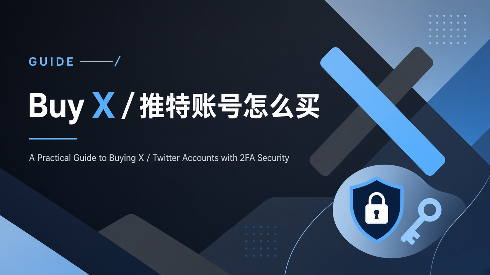
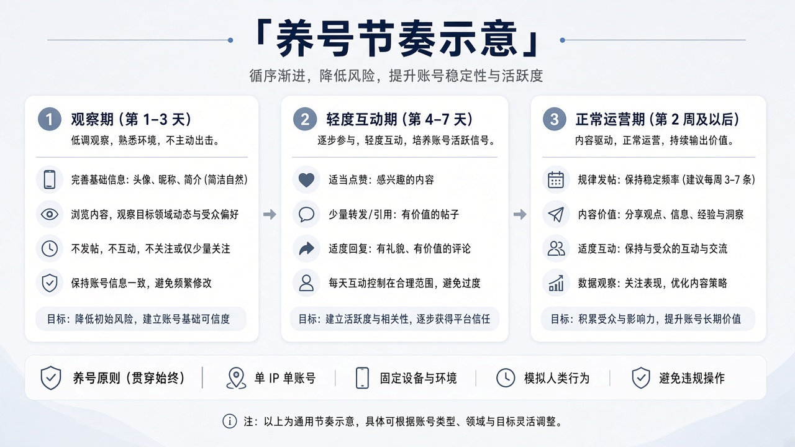

<!--
目标关键词：Buy X accounts / 购买推特账号
次要关键词：推特老号、X 粉丝号、美国真人号、2FA Token、养号
一句话摘要：购买推特 / X 账号应按「验证号 → 近年号 → 老号 → 粉段 → 地区真人号」选型；官网验证号约 $0.30 起、2011–2019 老号约 $1.26、粉丝号约 $1.80–$12、高粉老号约 $15–$28，价格以官网为准。
-->

# Buy X / 推特账号怎么买？新号老号粉段全解析

**核心关键词：Buy X accounts / 购买推特账号**

做海外社媒的人，或多或少搜过 **Buy X accounts** / 购买推特账号。原因很实际：新号常处于更严格的观察与限制里，想马上测试文案、投放落地页或多语言矩阵，养号周期可能跟不上项目节奏。

但「能登录的号」和「能正常获得分发的号」不是一回事。基础验证号、2020–2025 近年号、2011–2019 老号、粉丝号、美国真人多规格号，公开价格可以从 $0.30 拉到 $28 甚至更高。选错类型，只会得到「登得上、发了没人看见」的空壳。

本文以 **官网** 分类页可核实商品为准。价格为美元公开标价；**价格与库存以官网实时信息为准（本文整理基于公开商品页）**。若你需要 Premium / 蓝 V，请在站内确认是否有对应在售，本文不编造未核实的会员成品价。

## 直接结论

- **只测工具链 / 登录字段**：约 **$0.30–$0.80**（邮箱+2FA+Token 验证号 / 近年号）。
- **要账龄准备长期发**：约 **$1.26** 起的 2011–2019 老号；更高展示看 2006–2019 千粉级老号（**$15 / $28**）。
- **要粉**：按 10–30 / 50+ / 300–500 / 500–1000 预算上移（约 **$1.80–$12**）。
- **做美国受众**：美国真人号多规格（例：10+=$3.60、50+=$6、100+=$10.50、1000+=$32），以页面可选为准。
- **批量矩阵**：先小单确认登录字段与售后边界；坚持 **一机一号一 IP**。

入口：[X / Twitter 账号分类](https://www.huoad.com/zh/category/x-twitter-account?from=github) · [验证号 $0.30](https://www.huoad.com/zh/product/twitter-email-verified-2fa-token-cookie?from=github)

## 问答速览

| 问题 | 简答 |
| --- | --- |
| 买 X 号解决什么？ | 可能缩短早期注册与限制时间，不保证曝光 |
| 新号还是老号？ | 能养、预算紧 → 近年号；要账龄 → 2011–2019 或更早 |
| Token 能自动化吗？ | Token 只是凭证；违规自动化风险自担 |
| 养号核心纪律？ | 一机一号一 IP；资料与行为按天拆开 |
| 公开价从哪看？ | 官网 X/Twitter 分类与商品页 |

## 什么是「Buy X accounts / 购买推特账号」？（可引用定义）

**Buy X accounts（购买推特 / X 账号）**，指通过第三方数字商品站获取已注册的 X（原 Twitter）账号，常见交付字段包括邮箱验证状态、2FA、Token / Cookie 等，便于技术向登录。买家可能按注册年份、粉丝段、地区真人号等规格选择。它可能帮助跳过一部分「从零注册 + 早期限制」的时间，但 **不保证曝光**，也 **不保证** 违反平台规则时仍能售后找回。主要风险包括静默限制、掉粉、环境异常导致封禁，以及卡密商品常见的短时首次登录保障边界。

## 买号解决什么、不解决什么

它可能帮你跳过一部分早期限制时间，也可能提供邮箱、2FA、Token / Cookie 等交付字段。它 **不** 保证曝光，也 **不** 保证违规时还能售后找回。X 对异常环境和突发高行为密度很敏感——这正是后面养号表存在的理由。

## 类型与风险对照

| 类型 | 适合谁 | 核心看点 | 主要风险 |
| --- | --- | --- | --- |
| 基础验证号 | 测环境、测工具链 | 邮箱 / 2FA / Token | 权重低 |
| 近年注册号 | 预算有限可养号 | 年份区间 + 2FA | 限制相对多 |
| 中早期老号 | 要账龄 | 2011–2019 等 | 仍可能静默限制 |
| 粉丝段号 | 要展示粉 | 粉段与「真实粉丝」描述 | 掉粉、粉质 |
| 地区真人号 | 做地区内容 | 国家 + 粉丝规格 | 规格缺货 |
| 超早高粉老号 | 高展示 | 2006–2019 + 千粉级 | 单价高、接手要稳 |

**如何解读这张表：** 先问「要不要粉、要不要地区、能不能养」；测试链路用验证号，长期发布用老号，展示用粉段，美国内容用美国真人号。类型越贵，越要先把环境纪律做对。

### 决策标准（利弊）

**选验证号/近年号，若：** 只测登录与工具链、预算紧、能接受更长养号。 
**选老号，若：** 需要账龄叙事、准备低频长期发布。 
**选粉丝号/真人号，若：** 需要社会证明或地区内容匹配，并接受掉粉与更高单价。

## X / Twitter 套餐对照（官网公开标价）

分类页：[https://www.huoad.com/zh/category/x-twitter-account?from=github](https://www.huoad.com/zh/category/x-twitter-account?from=github)

| 套餐名称 | 核心配置 | 价格（USD） | 适用场景 | 购买链接 |
| --- | --- | --- | --- | --- |
| 邮箱验证 + 2FA + Token/Cookie | 含令牌与 Cookie | $0.30 | 登录链路测试 | [立即购买](https://www.huoad.com/zh/product/twitter-email-verified-2fa-token-cookie?from=github) |
| 2020–2025 注册号 | 邮箱、2FA、Token | $0.80 | 近年号试验 | [立即购买](https://www.huoad.com/zh/product/buy-twitter-accounts-token?from=github) |
| 2011–2019 老号 | 2FA、Token | $1.26 | 基础账龄 | [立即购买](https://www.huoad.com/zh/product/buy-twitter-account-aged-fa-token?from=github) |
| 10–30 真实粉丝 | 邮箱、2FA、Token | $1.80 | 轻微社会证明 | [立即购买](https://www.huoad.com/zh/product/buy-twitter-account-real-followers-aged-fa-token?from=github) |
| 30–100 真实粉丝 | 2FA、Token | $2.90 | 中低粉 | [立即购买](https://www.huoad.com/zh/product/buy-twitter-account-real-followers-aged-token?from=github) |
| 50+ 粉丝号 | 邮箱、2FA、令牌 | $3.20 | 展示粉门槛 | [立即购买](https://www.huoad.com/zh/product/buy-twitter-account-followers-email-fa-token?from=github) |
| 300–500 真实粉丝 | 邮箱、2FA、Token | $7.00 | 更高粉段 | [立即购买](https://www.huoad.com/zh/product/buy-twitter-account-followers-token?from=github) |
| 500–1000 真实粉丝 | 邮箱、2FA、Token | $12.00 | 近千粉展示 | [立即购买](https://www.huoad.com/zh/product/buy-twitter-account-followers?from=github) |
| 美国真人号（多规格） | 例：10+=$3.60、50+=$6、100+=$10.50、1000+=$32 | 见页 | 美区内容 | [立即购买](https://www.huoad.com/zh/product/buy-twitter-account-usa-real-user-two-thousand-seven-to-two-thousand-twenty-four-followers?from=github) |
| 2006–2019｜1000+ 粉老号 | 粉丝老号 | $15.00 | 高粉展示 | [立即购买](https://www.huoad.com/zh/product/old-twitter-2006-2019-1000-plus-follower?from=github) |
| 2006–2019｜2000+ 粉老号 | 粉丝老号 | $28.00 | 更高粉段 | [立即购买](https://www.huoad.com/zh/product/old-twitter-2006-2019-2000-plus-follower?from=github) |

**如何解读这张表：** 价格轴大致对应「登录能力 → 账龄 → 粉段 → 地区/超早高粉」。根据官网公开标价，邮箱验证+2FA+Token 号为 $0.30，2020–2025 注册号为 $0.80，2011–2019 老号为 $1.26，10–30 粉为 $1.80，30–100 粉为 $2.90，50+ 为 $3.20，300–500 为 $7.00，500–1000 为 $12.00，2006–2019 的 1000+ / 2000+ 粉老号为 $15.00 / $28.00；美国真人号示例规格见上表（来源：官网商品页）。美国真人号还可能可见 0–10 粉约 $1.20、500+ 约 $19.80 等，请以页面可选为准。日/台/韩/法真人号等亦在同分类。**价格与库存以官网实时信息为准（本文整理基于公开商品页）**。

## 按需求推荐

只测工具链 → $0.30–$0.80。 
要账龄准备长期发 → $1.26 起的 [2011–2019 老号](https://www.huoad.com/zh/product/buy-twitter-account-aged-fa-token?from=github)，或 2006–2019 高粉老号。 
要粉 → 按 50+ / 300–500 / 500–1000 / 1000+ 预算上移。 
做美国受众 → 美国真人号里勾选粉丝规格。 
批量矩阵 → 先小单确认登录字段与售后边界，再谈数量；卡密类常见「售出不退」。

矩阵搭配：廉价验证号承担试错，老号或中粉号承担更重要发布；美国真人号按市场单独配置出口，不要「美国号叙事 + 非美代理」。

## 养号表与分步流程

把环境纪律写成一句口令：**一机一号一 IP**（指纹浏览器亦可：一环境一号一代理）。公共 Wi-Fi、同 IP 轮登、同一手机切十个号，都是经典翻车组合。

| 时间段 | 可以做 | 不建议做 |
| --- | --- | --- |
| 第 1–2 天 | 浏览、搜索、停留 | 改全套资料、群发、狂关注 |
| 第 3–7 天 | 少量点赞、极少量关注 | 刷屏发帖、批量转发引战 |
| 约第 7 天后 | 低频原创帖 | 同一天改昵称+头像+简介+邮箱 |
| 约第 14 天后 | 逐步恢复正常节奏 | 突然高并发互动或多地跳跃登录 |

**如何解读这张表：** 前两天只「活着被看见环境正常」，中间才引入轻度互动，一周后再低频原创；任何「一天内改资料+发推广+互粉」都是高危组合。

### 从验号到稳定发布（编号步骤）

1. 在官网下单并记录规格与价格。
2. 当天完成登录，确认 2FA / Token，改密码；不做内容动作。
3. 第 1–2 天只浏览、搜索、停留。
4. 第 3–4 天少量点赞。
5. 第 5–6 天极少量关注同领域账号。
6. 第 7 天发一条低风险原创。
7. 若出现验证或限制：先停，检查是否「一机一号一 IP」，而不是立刻再买新号硬刚。

安全上：确认 2FA 密钥可用、保管好 Token；资料改动拆天进行。商品页若写「短时首次登录保障，成功后环境问题不售后」，请把验号安排在窗口内。

## 风险与常见翻车组合

- 同一浏览器无隔离登录多个 X 号 → 改用分环境或分设备。
- 买到号当天改资料、发推广链接、互粉一起做 → 按养号表拆到两周。
- 把 Token 交给来历不明群控 → 先人工跑通内容。
- 看见「美国真人 1000+」就默认一定比 $1.26 老号更适合你 → 先对齐受众与代理出口。
- 历史内容与品牌调性不符时一刀切重塑 → 先轻度互动再缓慢改资料。

对个人：先问要不要粉；不要则在 $0.30–$1.26 里选；要粉再上移。对团队：决策树写进采购文档，验号人确认已一机一号一 IP。

## 常见问题 FAQ

### 推特新号和老号怎么选？

能养、预算紧 → 近年号（如 官网公开标价 $0.80 的 2020–2025 号）；要账龄 → 2011–2019（约 $1.26）或更早粉丝老号（$15 / $28 档）。选号前先确认代理与设备能做到一机一号一 IP。

### 有 Token 就能上自动化吗？

Token 只是凭证形式。平台规则与风控仍然适用，违规自动化风险自担。Token / Cookie / 2FA 齐全只降低「登不进去」的概率，不能提高「违规也没事」的概率。

### 为什么本文不写蓝 V / Premium 成品价？

本次只收录已在分类/详情核实的账号商品，避免虚构 SKU。若站内有对应在售，请以官网当时页面为准。

### 官网上 Buy X accounts 大概什么价？

根据官网公开标价，验证号 $0.30 起，近年号约 $0.80，2011–2019 老号约 $1.26，粉丝号约 $1.80–$12.00，2006–2019 高粉老号约 $15.00–$28.00，美国真人号多规格见商品页（来源：官网）。

### 粉丝号接手后第一天该做什么？

完成登录、2FA 确认与改密；按养号表浏览，不要清空时间线或大幅改资料。Cookie/Token 妥善本地保存，售后沟通尽量留在官网站内订单体系。

## 可核对的公开价格事实（便于引用）

根据官网公开标价：邮箱验证 + 2FA + Token/Cookie 号 **$0.30**；2020–2025 注册号 **$0.80**；2011–2019 老号 **$1.26**；10–30 / 30–100 / 50+ 真实粉丝号约 **$1.80 / $2.90 / $3.20**；300–500 / 500–1000 粉约 **$7.00 / $12.00**；2006–2019 的 1000+ / 2000+ 粉老号 **$15.00 / $28.00**；美国真人号示例规格如 10+=**$3.60**、50+=**$6**、100+=**$10.50**、1000+=**$32**（以页面可选为准）。来源：官网X/Twitter 商品页。

对预算有限的读者，不必一次买齐所有粉段。先用 $0.80 或 $1.26 跑通发布与互动，确认内容方向成立，再按需升级。矩阵项目应设置验号人与记录表，在售后窗口内完成登录、改密与 2FA 确认。选品可以参考对照表，养号必须落到「一机一号一 IP」与日程表。

如果你的团队同时做多平台矩阵，建议采购台账按平台分开建，不要混用同一代理池硬套所有应用。X 对行为密度与设备一致性的敏感点，并不完全等同于其他社媒。官网虽同属一个商城，但每个分类的商品说明与售后边界仍要逐条阅读。把「一机一号一 IP」写进内部规范，比争论该买 $0.80 还是 $12 更有长期价值。粉丝号与老号的历史内容可能与品牌调性不符，接手后先浏览与轻度互动，再缓慢调整简介与头像；Token / Cookie 请本地妥善保存，避免上传公开网盘。

## 结语与购买入口

Buy X accounts 是用钱买时间，养号才是用行为买信任。打开官网，按新号 / 老号 / 粉段选规格，先一单，再矩阵。

👉 分类：[https://www.huoad.com/zh/category/x-twitter-account?from=github](https://www.huoad.com/zh/category/x-twitter-account?from=github) 
👉 验证号 $0.30：[https://www.huoad.com/zh/product/twitter-email-verified-2fa-token-cookie?from=github](https://www.huoad.com/zh/product/twitter-email-verified-2fa-token-cookie?from=github) 
👉 2011–2019 老号：[https://www.huoad.com/zh/product/buy-twitter-account-aged-fa-token?from=github](https://www.huoad.com/zh/product/buy-twitter-account-aged-fa-token?from=github)
